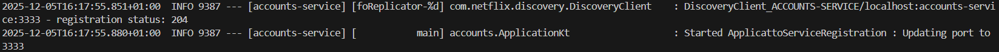
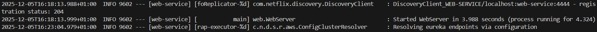
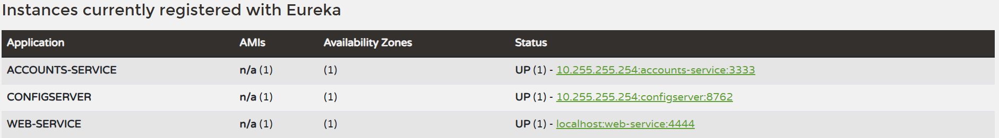
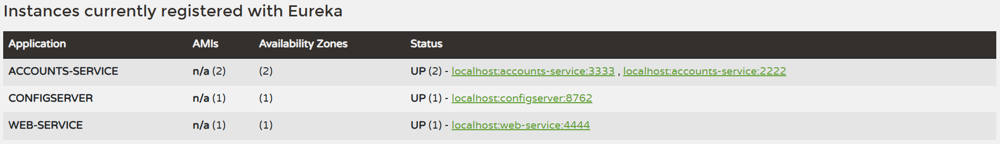
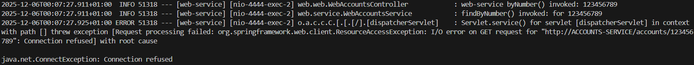
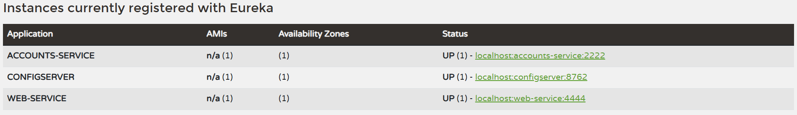

# Lab 6 Microservices - Project Report

## 1. Configuration Setup

**Configuration Repository**: [Link to your forked repository]

Describe the changes you made to the configuration:

- What did you modify in `accounts-service.yml`?
- Why is externalized configuration useful in microservices?

---

## 2. Service Registration (Task 1)

### Accounts Service Registration



1. Se prepara e inicializa cliente Eureka:
```text
Setting initial instance status as: STARTING
Initializing Eureka in region us-east-1
Resolving eureka endpoints via configuration
```
2. Se obtiene la lista actual de servicios registrados:
```text
Getting all instance registry info from the eureka server
The response status is 200
```
3. Se inicia el heartbeat y el replicador:
```text
Starting heartbeat executor: renew interval is: 30
InstanceInfoReplicator onDemand update allowed rate per min is 4
```
4. Se registra el servicio con estado UP:
```text
Registering application ACCOUNTS-SERVICE with eureka with status UP
Saw local status change event StatusChangeEvent [timestamp=1764951972071, current=UP, previous=STARTING]
DiscoveryClient_ACCOUNTS-SERVICE/10.255.255.254:accounts-service:3333: registering service...
```
5. Se completa el inicia del servidor:
```text
Tomcat started on port 3333 (http) with context path '/'
```
6. Se confirma el registro:
```text
DiscoveryClient_ACCOUNTS-SERVICE/10.255.255.254:accounts-service:3333 - registration status: 204
```

### Web Service Registration



Explain how the web service discovers the accounts service.
1. El servcio web pregunta a Eureka por instancias de "ACCOUNTS-SERVICE" mediante RestTemplate.
2. Eureka selecciona una instancia disponible con balanceo de carga.
3. Se sustituye "ACCOUNTS-SERVICE" por la URL y puerto en el que se encuentra la instancia devuelta por Eureka.

---

## 3. Eureka Dashboard (Task 2)



Describe what the Eureka dashboard shows:

- Which services are registered?
Aparecen registrados el servidor de configuración, el servicio 'accounts' y el servicio 'web'.
- What information does Eureka track for each instance?
1. Application: El nombre de la aplicación o servicio.
2. AMIs: Información sobre Amazon Machine Image (no aplica) y número de instancias.
3. Availability Zones: zonas en las que hay instancias desplegadas (no aplica, entorno local) y número de instancias.
4. Status: Estado e instancias en dicho estado y dirección de acceso al servicio.  

---

## 4. Multiple Instances (Task 4)



Answer the following questions:

- What happens when you start a second instance of the accounts service?
Aparece una nueva instancia del servicio, con su correspondiente dirección de acceso (en este caso con otro puerto)
- How does Eureka handle multiple instances?
Eureka permite varias instancias de un mismo servicio, cada una con su dirección y puerto de forma que se diferencien.
- How does client-side load balancing work with multiple instances?
El cliente solicita un listado de todas las instancias del servicio, y es el propio cliente, con su política de balanceo, el que determina qué instancia utiliza.

---

## 5. Service Failure Analysis (Task 5)

### Initial Failure



Describe what happens immediately after stopping the accounts service on port 3333.

### Eureka Instance Removal



Explain how Eureka detects and removes the failed instance:

- How long did it take for Eureka to remove the dead instance?
- What mechanism does Eureka use to detect failures?

---

## 6. Service Recovery Analysis (Task 6)


Answer the following questions:

- Why does the web service eventually recover?
- How long did recovery take?
- What role does client-side caching play in the recovery process?

---

## 7. Conclusions

Summarize what you learned about:

- Microservices architecture
- Service discovery with Eureka
- System resilience and self-healing
- Challenges you encountered and how you solved them

---

## 8. AI Disclosure

**Did you use AI tools?** (ChatGPT, Copilot, Claude, etc.)

- If YES: Which tools? What did they help with? What did you do yourself?
- If NO: Write "No AI tools were used."

**Important**: Explain your own understanding of microservices patterns and Eureka behavior, even if AI helped you write parts of this report.

---

## Additional Notes

Any other observations or comments about the assignment.

